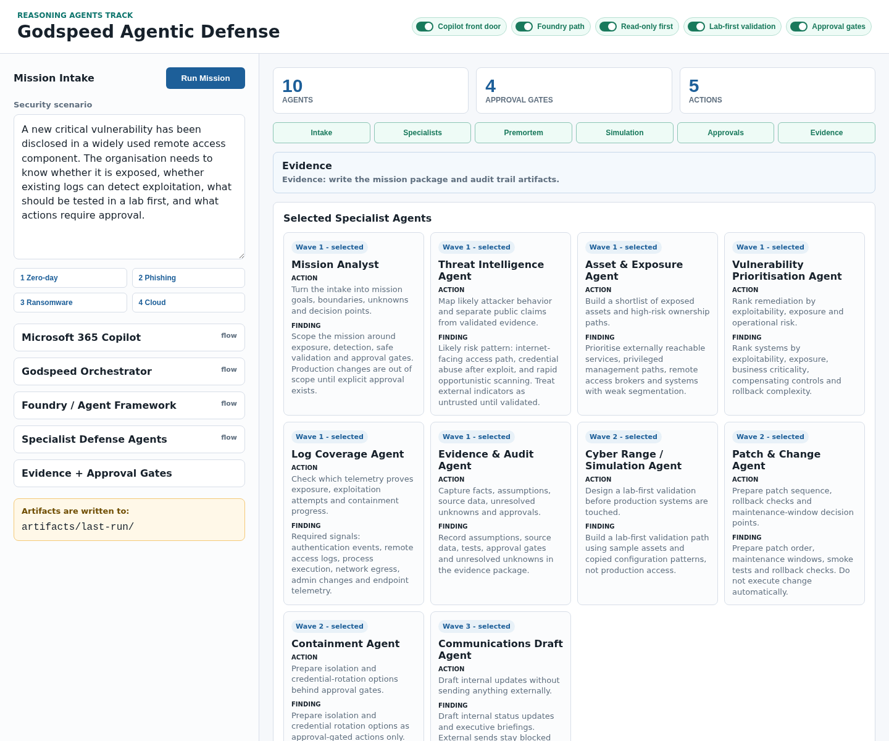

# Godspeed Agentic Defense

Godspeed is a hackathon demo for governed agentic defense missions.

It turns a high-pressure security scenario into a controlled mission plan: the right specialist agents, the right evidence, the right approval gates, and a clear executive defense package.

GODSPEED stands for:

**Governed Orchestration for Defense, Simulation, Prioritisation, Evidence, Execution and Decisioning.**

## Track Fit

Recommended hackathon track: **Reasoning Agents**.

Why: the core challenge is not a chatbot UI. The core challenge is multi-step reasoning under operational risk:

- understand the mission and non-goals;
- separate facts, assumptions and unknowns;
- select specialist agents in waves;
- reason about threat, exposure, logs, patch order and simulation;
- block risky actions until a human approves them;
- produce evidence that can be reviewed and replayed.

## Microsoft Fit

The demo is designed as a Microsoft-native architecture:

- **Microsoft 365 Copilot / Copilot Studio** as the enterprise front door;
- **Microsoft Foundry Agent Service** as the managed agent runtime path;
- **Microsoft Agent Framework** as the multi-agent orchestration implementation path;
- **GitHub Copilot** as the developer acceleration story;
- **Godspeed** as the command layer that turns a vague security request into a governed defense mission.

The live demo in this repository runs in a local sandbox profile so it can be shown without tenant secrets, production access, or customer data. The `microsoft/` folder contains the Foundry and Copilot implementation bridge for the hackathon story.

This repository is explicit about the boundary: the demo is a working sandbox prototype of the Godspeed orchestrator. The production path is Microsoft 365 Copilot or Copilot Studio as the front door, with Microsoft Foundry Agent Service and Microsoft Agent Framework as the managed agent runtime and workflow layer.

The repo now includes a Copilot-ready bridge endpoint and import contract:

- `POST /api/microsoft/copilot/mission` returns a Copilot-friendly mission package.
- `POST /api/microsoft/agent-framework/event` returns a workflow seed event.
- `microsoft/copilot-studio-openapi-v2.json` is the OpenAPI v2 import file for Copilot Studio REST API tools.

## What The Demo Shows

The app turns one security scenario into:

- mission intake;
- selected specialist agents;
- facts, assumptions and unknowns;
- premortem failure analysis;
- lab-first simulation plan;
- approval gates for risky actions;
- evidence artifacts;
- executive summary.

## Interface Preview



## Run Locally

Requirements:

- Node.js 22 or newer.

```bash
npm install
npm run check
npm run check:microsoft
npm start
```

Open:

```text
http://127.0.0.1:8088/
```

CLI demo:

```bash
npm run mission
```

Artifacts are written to:

```text
artifacts/last-run/
```

Final demo narration assets are kept in:

```text
artifacts/voice/
```

## Suggested Demo Prompt

```text
A new critical vulnerability has been disclosed in a widely used remote access component. The organisation needs to know whether it is exposed, whether existing logs can detect exploitation, what should be tested in a lab first, and what actions require approval.
```

## Safety Boundary

This is demo mode:

- sample data only;
- no production access;
- no real secrets;
- no external messages;
- no automatic remediation;
- risky actions are approval-gated by default.

## Repository Map

- `src/` - local Godspeed mission engine and API.
- `public/` - browser demo UI.
- `sample-data/` - safe sample assets and signals.
- `docs/` - architecture, submission draft, video script and security boundaries.
- `architecture/` - standalone architecture diagram.
- `artifacts/screenshots/` - interface screenshot for the submission.
- `artifacts/voice/` - final demo voice-over assets.
- `microsoft/` - Copilot REST API tool contract, Foundry / Agent Framework bridge and workflow concept.
- `scripts/validate-microsoft-bridge.mjs` - local validation for the Copilot/Agent Framework bridge contract.
- `systemd/` and `nginx/` - optional deployment examples.

## Architecture

See:

- `architecture/godspeed-architecture.svg`
- `docs/architecture.md`
- `docs/technical-background.md`
- `docs/microsoft-implementation-path.md`
- `microsoft/godspeed-mission.openapi.yaml`
- `microsoft/copilot-studio-openapi-v2.json`
- `microsoft/copilot-studio-rest-api-tool.md`
- `microsoft/foundry-agent-framework-bridge.md`

## Submission Positioning

One-line pitch:

> Godspeed makes Copilot operationally useful for security by converting a vague, urgent scenario into a governed defense mission with specialist agents, approval gates and evidence.

See `docs/submission-draft.md` for the full project description.
